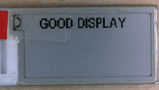
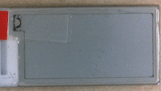
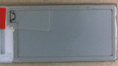
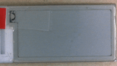

# GDEM0097T61 Arduino

A 'fork' of GoodDisplay's Arduino demo for the GDEM0097T61 0.97 inch e-paper display.

You can download the original GoodDisplay demo [here](https://www.good-display.com/product/486.html).

This version has been tweaked by PaulZC to illustrate how partial updates work on this display.

By default, the SSD1680 "ping-pong" mode is enabled on the GDEM0097T61. "Ping-pong" - automatic swapping of the pixel RAM bank - works well, but causes some interesting challenges when you try to use partial updates.

You can prove that ping-pong mode is enabled by reading the OTP Display Option using command 0x2D. Command 0x2D (Read SSD1680 OTP Register) returns 11 bytes: ```0x00 0x00 0x00 0x01 0x00 0x00 0x40 0x00 0x00 0x00 0x00```

```
VCOM OTP Selection (Command 0x37, Byte A):  0x00
VCOM Register (Command 0x2C):               0x00
Display Mode (Command 0x37, Bytes B-F):     0x00 0x01 0x00 0x00 0x40
Waveform version (Command 0x37, Bytes G-J): 0x00 0x00 0x00 0x00
```

The `1` in bit `F[6]` indicates PingPong for Display Mode 2 - RAM Ping-Pong - is enabled.

This means that after each partial update, the RAM bank is automatically switched to the alternate for the next write and display cycle. This is to speed up updating the display, allowing the alternate bank to be updated while the display is busy with the other. But this causes some challenges...

The original GoodDisplay partial update "Time" demo only works because all five time digits (```HH:MM```) are updated each time. If you try to selectively change a single digit, by overwriting it with a space then a new digit, you will see some very interesting effects.

This is GoodDisplay's original demo:

```
  #if 1 //Partial update demostration.
  //Partial update demo support displaying a clock at 5 locations with 00:00.  If you need to perform partial update more than 5 locations, please use the feature of using partial update at the full screen demo.
  //After 5 partial updatees, implement a full screen update to clear the ghosting caused by partial updatees.
  //////////////////////Partial update time demo/////////////////////////////////////
      EPD_HW_Init(); //Electronic paper initialization. 
      EPD_SetRAMValue_BaseMap(gImage_basemap); //Please do not delete the background color function, otherwise it will cause unstable display during partial update.
      for(i=0;i<6;i++)
      EPD_Dis_Part_Time(32,56+24*0,Num[i],         //x-A,y-A,DATA-A
                        32,56+24*1,Num[0],         //x-B,y-B,DATA-B
                        32,56+24*2,gImage_numdot, //x-C,y-C,DATA-C
                        32,56+24*3,Num[0],        //x-D,y-D,DATA-D
                        32,56+24*4,Num[1],24,32); //x-E,y-E,DATA-E,Resolution 24*32
          

      EPD_DeepSleep();  //Enter the sleep mode and please do not delete it, otherwise it will reduce the lifespan of the screen.
      delay(2000); //Delay for 2s.
      EPD_HW_Init(); //Full screen update initialization.
      EPD_WhiteScreen_White(); //Clear screen function.
      EPD_DeepSleep(); //Enter the sleep mode and please do not delete it, otherwise it will reduce the lifespan of the screen.
      delay(2000); //Delay for 2s.
  #endif  
```

Like I say, it only works because all five digits are written each time.

If you change their demonstration to the following, you can make the time blink off and on. But, again, it only works because all five digits are written each time.



```
#if 1 //Partial update demostration.
    //Partial update demo support displaying a blinking clock at 5 locations with 00:00.
    //Paul's note: this only works because all five digits are overwritten simultaneously
    //////////////////////Partial update time demo/////////////////////////////////////
    EPD_HW_Init(); //Electronic paper initialization. 
    EPD_SetRAMValue_BaseMap(gImage_basemap); //Please do not delete the background color function, otherwise it will cause unstable display during partial update.
    for(i=0;i<19;i++)
        EPD_Dis_Part_Time(32,56+24*0,i % 2 == 0 ? Num[i / 2] : gImage_space,    //x-A,y-A,DATA-A
                          32,56+24*1,i % 2 == 0 ? Num[i / 2] : gImage_space,    //x-B,y-B,DATA-B
                          32,56+24*2,i % 2 == 0 ? gImage_numdot : gImage_space, //x-C,y-C,DATA-C
                          32,56+24*3,i % 2 == 0 ? Num[i / 2] : gImage_space,    //x-D,y-D,DATA-D
                          32,56+24*4,i % 2 == 0 ? Num[i / 2] : gImage_space,    //x-E,y-E,DATA-E,
                          24,32); //Resolution 24*32
    EPD_DeepSleep();  //Enter the sleep mode and please do not delete it, otherwise it will reduce the lifespan of the screen.
    delay(2000); //Delay for 2s.
    EPD_HW_Init(); //Full screen update initialization.
    EPD_WhiteScreen_White(); //Clear screen function.
    EPD_DeepSleep(); //Enter the sleep mode and please do not delete it, otherwise it will reduce the lifespan of the screen.
    delay(2000); //Delay for 2s.
#endif  
```

If you change the demo so that it 'scrolls' the digits 6 to 0, from right to left across the display, it works successfully if you overwrite all seven positions with spaces before adding the new digit:



```
#if 1 //Paul's partial update demostration.
    // Ping-pong is enabled by default and causes problems.
    // We can only appear to shift a digit along by one if
    // we fully erase the space occupied by all digits and
    // then add in the new digit.
    EPD_HW_Init(); //Electronic paper initialization. 
    EPD_SetRAMValue_BaseMap(gImage_basemap); //Please do not delete the background color function, otherwise it will cause unstable display during partial update.
    for(i=0;i<3;i++)
    {
        for(j=0;j<7;j++)
        {
          for(k=0;k<7;k++)
          {
            // Erase all previous digits
            EPD_Dis_Part_RAM(32,32+(24*k),gImage_space,24,32); //Resolution 24*32
          }

          // Add new digit
          EPD_Dis_Part_RAM(32,32+(24*j),Num[6-j],24,32); //Resolution 24*32

          EPD_Part_Update();
        }
    }

    // Erase last digit by erasing all previous digits
    for(k=0;k<7;k++)
    {
      EPD_Dis_Part_RAM(32,32+(24*k),gImage_space,24,32); //Resolution 24*32
    }
    EPD_Part_Update();
    
    EPD_DeepSleep();  //Enter the sleep mode and please do not delete it, otherwise it will reduce the lifespan of the screen.
    delay(2000); //Delay for 2s.
    
    EPD_HW_Init(); //Full screen update initialization.
    EPD_WhiteScreen_White(); //Clear screen function.
    EPD_DeepSleep(); //Enter the sleep mode and please do not delete it, otherwise it will reduce the lifespan of the screen.
    delay(2000); //Delay for 2s.
#endif  
```

If you change the demo so it erases only the single previous digit, you get some very interesting weirdness!



```
#if 1 //Paul's partial update demostration.
    // Ping-pong is enabled by default and causes problems.
    // We can only appear to shift a digit along by one if
    // we fully erase the space occupied by all digits and
    // then add in the new digit.
    // In this demo only the previous digit is erased,
    // resulting in much alternate digit weirdness!
    EPD_HW_Init(); //Electronic paper initialization. 
    EPD_SetRAMValue_BaseMap(gImage_basemap); //Please do not delete the background color function, otherwise it will cause unstable display during partial update.
    for(j=0;j<3;j++)
    {
        for(i=0;i<7;i++)
        {
          if (i > 0)
          {
            // Erase previous digit
            EPD_Dis_Part_RAM(32,32+(24*(i - 1)),gImage_space,24,32); //Resolution 24*32
          }
          else if (j > 0)
          {
            // Erase previous last digit
            EPD_Dis_Part_RAM(32,32+(24*6),gImage_space,24,32); //Resolution 24*32
          }

          // Add new digit
          EPD_Dis_Part_RAM(32,32+(24*i),Num[6-i],24,32); //Resolution 24*32

          EPD_Part_Update();
        }
    }

    EPD_DeepSleep();  //Enter the sleep mode and please do not delete it, otherwise it will reduce the lifespan of the screen.
    delay(2000); //Delay for 2s.
    
    EPD_HW_Init(); //Full screen update initialization.
    EPD_WhiteScreen_White(); //Clear screen function.
    EPD_DeepSleep(); //Enter the sleep mode and please do not delete it, otherwise it will reduce the lifespan of the screen.
    delay(2000); //Delay for 2s.
#endif
```

The solution for the single digit erase is to perform each partial update twice, then both RAM banks receive the update:



```
#if 1 //Paul's partial update demostration.
    // Ping-pong is enabled by default and causes problems.
    // If we want to only erase the previous digit,
    // before adding the new digit, we need to write twice
    // so both halves of the RAM are updated each time.
    EPD_HW_Init(); //Electronic paper initialization. 
    EPD_SetRAMValue_BaseMap(gImage_basemap); //Please do not delete the background color function, otherwise it will cause unstable display during partial update.
    for(j=0;j<3;j++)
    {
      for(i=0;i<7;i++)
      {
        for(k=0;k<2;k++) // Do each erase and add twice!
        {
          if (i > 0)
          {
            // Erase previous digit
            EPD_Dis_Part_RAM(32,32+(24*(i - 1)),gImage_space,24,32); //Resolution 24*32
          }
          else if (j > 0)
          {
            // Erase previous last digit
            EPD_Dis_Part_RAM(32,32+(24*6),gImage_space,24,32); //Resolution 24*32
          }

          // Add new digit
          EPD_Dis_Part_RAM(32,32+(24*i),Num[6-i],24,32); //Resolution 24*32

          EPD_Part_Update();
        }
      }
    }

    // Erase last digit
    EPD_Dis_Part_RAM(32,32+(24*6),gImage_space,24,32); //Resolution 24*32
    EPD_Part_Update();
    
    EPD_DeepSleep();  //Enter the sleep mode and please do not delete it, otherwise it will reduce the lifespan of the screen.
    delay(2000); //Delay for 2s.
    
    EPD_HW_Init(); //Full screen update initialization.
    EPD_WhiteScreen_White(); //Clear screen function.
    EPD_DeepSleep(); //Enter the sleep mode and please do not delete it, otherwise it will reduce the lifespan of the screen.
    delay(2000); //Delay for 2s.
#endif
```

The full modified demo source code can be found in the [GDEM0097T61_Arduino folder](./GDEM0097T61_Arduino/).

Enjoy!

Paul
